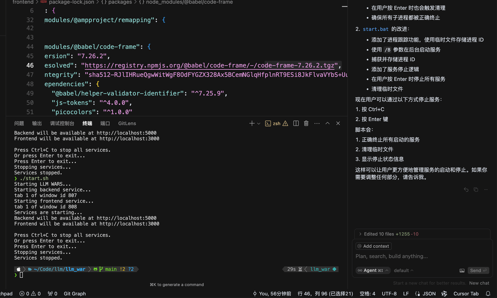

# LLM WARS

一个用于比较不同 LLM 模型输出的 Web 应用。支持 OpenAI、Anthropic、Google 等主流 LLM 服务。




## 功能特点

- 支持多个 LLM 模型配置
- 实时比较不同模型的输出结果
- 支持系统提示词（System Prompt）
- 支持全屏查看结果
- 自动保存模型配置
- 支持复制、编辑和删除配置
- 响应式设计，支持移动端

## 支持的模型服务

- OpenAI API
- Anthropic Claude
- Google Gemini
- OpenAI 兼容 API

## 安装步骤

1. 克隆项目

```bash
git clone https://github.com/GUTYL/llm_war.git
cd llm_war
```

2. 安装后端依赖

```bash
# 创建虚拟环境
python -m venv venv

# 激活虚拟环境
# Windows:
venv\Scripts\activate
# Linux/Mac:
source venv/bin/activate

# 安装依赖
pip install -r requirements.txt
```

3. 安装前端依赖

```bash
cd frontend
npm install
```

## 运行项目

### 方式一：一键运行（推荐）

Windows 系统：

```bash
# 双击运行 start.bat
# 或在命令行中运行
.\start.bat
```

Unix/Linux/Mac 系统：

```bash
# 添加执行权限
chmod +x start.sh

# 运行脚本
./start.sh
```

### 方式二：手动运行

1. 启动后端服务

```bash
# 在项目根目录下
python app.py
```

2. 启动前端开发服务器

```bash
# 在 frontend 目录下
npm start
```

3. 访问应用
   打开浏览器访问 `http://localhost:3000`

## 使用说明

1. 添加模型配置
   - 点击"添加模型"按钮
   - 填写模型配置信息（名称、提供商、API密钥等）
   - 点击保存
2. 发送查询
   - 在提示词设置区域输入系统提示词（可选）和用户提示词
   - 点击"发送查询"按钮
   - 等待所有模型返回结果
3. 查看结果
   - 结果会以卡片形式显示
   - 可以点击展开/折叠查看详细内容
   - 支持全屏查看单个结果
4. 管理配置
   - 可以复制、编辑或删除已有的模型配置
   - 配置会自动保存到本地

## 注意事项

- 请妥善保管 API 密钥，不要将其提交到代码仓库
- 建议使用环境变量或配置文件存储敏感信息
- 确保网络环境能够访问各个 LLM 服务

## 贡献指南

欢迎提交 Issue 和 Pull Request 来帮助改进项目。

## 许可证

MIT License
